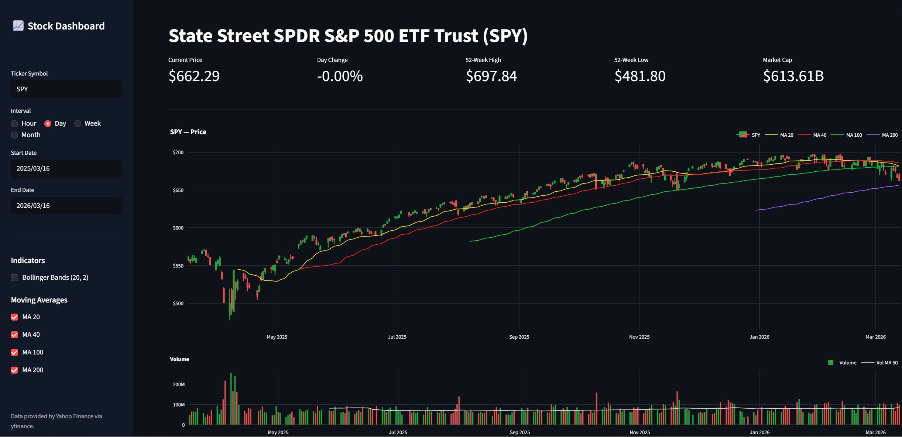

<div align="center">

# 📈 Stock Dashboard

**A real-time financial dashboard for stocks and crypto — built with Streamlit.**

[](https://www.python.org/)
[](https://streamlit.io/)
[](https://plotly.com/)
[](https://github.com/ranaroussi/yfinance)

</div>

---

## Preview



> *Full-screen dark-themed dashboard showing SPDR S&P 500 (SPY) with live price metrics, an interactive candlestick chart, and a color-coded volume chart.*

---

## Motivation

This is a personal side project born from two genuine interests: **learning Streamlit** and **a passion for financial markets**.

I trade options in the US market as a small retail trader, and I wanted a tool that felt familiar — something built around the way I actually think about price action: candlestick patterns, moving averages, volume context, and volatility signals like Bollinger Bands. Rather than relying on generic platforms, building my own gave me full control over what I see and how I see it.

On the technical side, I already had a solid Python foundation and wanted to push it further by picking up Streamlit — a framework I hadn't worked with before. This project was the perfect excuse: it's visual, data-driven, and immediately useful. Working through real problems like MultiIndex DataFrame handling, Plotly layout customisation, and caching live API data taught me far more than any tutorial would have.

The result is a tool I genuinely use, built with skills I genuinely wanted to develop.

---

## Features

- **Interactive Candlestick Chart** — OHLC price history with zoom, pan, and hover tooltips
- **Color-Coded Volume Chart** — Green/red bars reflecting bullish or bearish sessions, with a 50-period MA overlay
- **Configurable Moving Averages** — Toggle MA 20, MA 40, MA 100, and MA 200 on/off independently
- **Bollinger Bands** — Optional 20-period, ±2 std dev overlay for volatility analysis
- **Live Key Metrics** — Current price, day change %, 52-week high/low, and market capitalisation
- **Flexible Time Controls** — Custom date range with hourly, daily, weekly, or monthly candle intervals
- **Stocks & Crypto** — Accepts any Yahoo Finance symbol: equities, ETFs, indices, and crypto pairs
- **Smart Data Caching** — 1-hour `@st.cache_data` cache minimises redundant API calls
- **Full Dark Theme** — Custom CSS injection for a consistent dark UI across all components

---

## Tech Stack

| Library | Version | Role |
|:---|:---|:---|
| [Streamlit](https://streamlit.io/) | ≥ 1.32 | Web app framework, UI, and sidebar controls |
| [Plotly](https://plotly.com/python/) | ≥ 5.20 | Interactive candlestick and volume charts |
| [yfinance](https://github.com/ranaroussi/yfinance) | ≥ 0.2.38 | Yahoo Finance OHLCV and ticker metadata |
| [Pandas](https://pandas.pydata.org/) | ≥ 2.2 | Data manipulation and indicator computation |

---

## Project Structure

```
dashboard/
├── app.py              # Entry point — Streamlit layout, sidebar, metrics row
├── data.py             # Data fetching (yfinance) and indicator calculation
├── charts.py           # Plotly figure builders (candlestick + volume)
├── requirements.txt    # Python dependencies
└── .streamlit/
    └── config.toml     # Streamlit server settings
```

---

## Getting Started

### Prerequisites

- **Python 3.10 or higher** — [Download](https://www.python.org/downloads/)
- **pip** (bundled with Python)

---

### Installation

**1. Clone the repository**

```bash
git clone https://github.com/your-username/stock-dashboard.git
cd stock-dashboard
```

**2. Create and activate a virtual environment** *(recommended)*

```bash
# Create the environment
python -m venv .venv

# Activate on Windows
.venv\Scripts\activate

# Activate on macOS / Linux
source .venv/bin/activate
```

**3. Install dependencies**

```bash
pip install -r requirements.txt
```

---

### Running the App

```bash
streamlit run app.py
```

The dashboard will open automatically in your browser at **[http://localhost:8501](http://localhost:8501)**.

---

## Usage

Use the sidebar to configure the dashboard:

| Control | Description |
|:---|:---|
| **Ticker Symbol** | Any valid Yahoo Finance symbol (see examples below) |
| **Interval** | `Hour` · `Day` · `Week` · `Month` — the candlestick period |
| **Start Date / End Date** | Define the visible date range |
| **Bollinger Bands** | Toggle a 20-period, ±2 std dev volatility envelope |
| **MA 20** | 20-period moving average — *yellow* |
| **MA 40** | 40-period moving average — *red* |
| **MA 100** | 100-period moving average — *green* |
| **MA 200** | 200-period moving average — *purple* |

### Supported Tickers

| Ticker | Description |
|:---|:---|
| `SPY` | S&P 500 ETF (SPDR) |
| `AAPL` | Apple Inc. |
| `TSLA` | Tesla Inc. |
| `MSFT` | Microsoft Corporation |
| `BTC-USD` | Bitcoin / US Dollar |
| `ETH-USD` | Ethereum / US Dollar |
| `^GSPC` | S&P 500 Index |
| `^DJI` | Dow Jones Industrial Average |

---

## Notes

- **Hourly interval** — Yahoo Finance limits hourly OHLCV data to the most recent 730 days. The app automatically clamps the start date if this limit is exceeded.
- **Auto-adjusted prices** — All OHLCV data is auto-adjusted for stock splits and dividends.
- **Data availability** — Coverage depends entirely on Yahoo Finance. Delisted or obscure tickers may return no data.

---

<div align="center">

*Data provided by [Yahoo Finance](https://finance.yahoo.com/) via [yfinance](https://github.com/ranaroussi/yfinance).*

</div>
